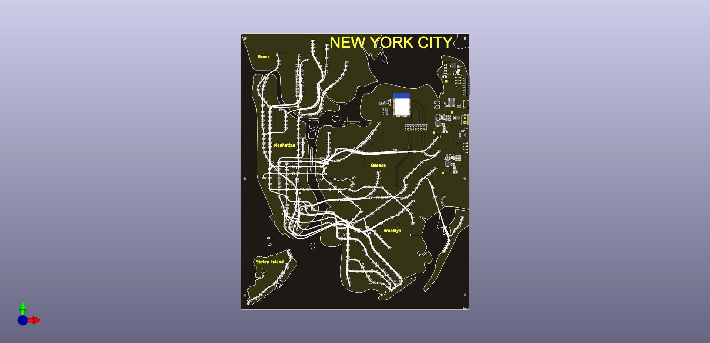

# NYC Subway PCB

Real-time NYC subway train tracker on a custom PCB with 478 WS2812B LEDs forming the subway map.



A Go server polls MTA's GTFS real-time feeds, renders train positions as pixel data, and streams it to an ESP32 over WiFi. Each LED lights up with the subway line's color when a train is at that station.

## Architecture

```
MTA GTFS-RT (9 feeds) → Go Server → protobuf → ESP32 → 478 LEDs
                              ↓
                     Web visualizer (:8080)
```

- **Server** polls MTA every 15s, maps trains to LED positions, serves pre-rendered pixel frames via protobuf
- **ESP32** connects to WiFi, fetches pixel data every second, drives 9 LED strips
- **Web UI** shows the same data overlaid on the PCB silkscreen (KiCad SVG)

## Quick Start

```bash
# Start the server (polls live MTA data, serves web UI + pixel API)
make server

# Flash production firmware to ESP32
make fw-flash

# Open web visualizer
open http://localhost:8080
```

## Project Structure

```
server/                    Go server
  cmd/subway-server/         Entry point
  internal/mta/              MTA feed polling + aggregation
  internal/api/              HTTP API + pixel rendering
  static/                    Web UI (board.js, app.js, leds.json, board.svg)
  led_map.json               Station → LED position mapping

firmware/                  ESP32 production firmware (PlatformIO + ESP-IDF)
  src/                       main.c, led_driver, subway_client
  proto/                     nanopb protobuf (PixelFrame)
  components/                External deps (esp_ghota, esp32-wifi-manager, led_strip)

proto/                     Shared protobuf schema (subway.proto)

pcb/                       KiCad hardware design files

tools/
  debug-firmware/            Arduino firmware for serial LED control
  led-debugger-ui/           Click-to-light web debugger (Python)
  led-mapping-ui/            LED position mapping tool (Python/Tkinter)
  serial-logger/             Resilient serial logger with auto-reconnect
```

## Make Targets

```
make help          Show all targets
make server        Build and start Go server
make fw-flash      Build and flash production firmware
make dbg-flash     Flash debug firmware (serial LED control)
make monitor       Start serial logger
make debugger      Start LED debugger web UI
make clean         Clean all build artifacts
```

## Hardware

- ESP32-WROOM-32 with CH340C USB-serial
- 478 WS2812B LEDs across 9 strips (GPIO 16-23, 25, 26)
- 12V barrel jack / battery terminal for LED power
- SN74LV1T34DBV level shifters (3.3V → 5V)

## Data Flow

1. Server fetches VehiclePosition from 9 MTA GTFS-RT feeds
2. Filters to STOPPED_AT trains only (actually at a station)
3. Maps station IDs to LED positions via `led_map.json`
4. Renders 478 RGB pixels with route-appropriate colors
5. Wraps in PixelFrame protobuf, serves at `GET /api/v1/pixels`
6. ESP32 polls every second, writes pixels directly to LED strips
